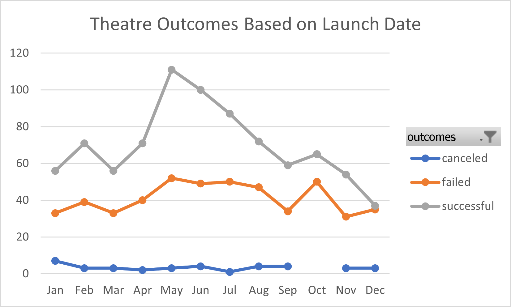
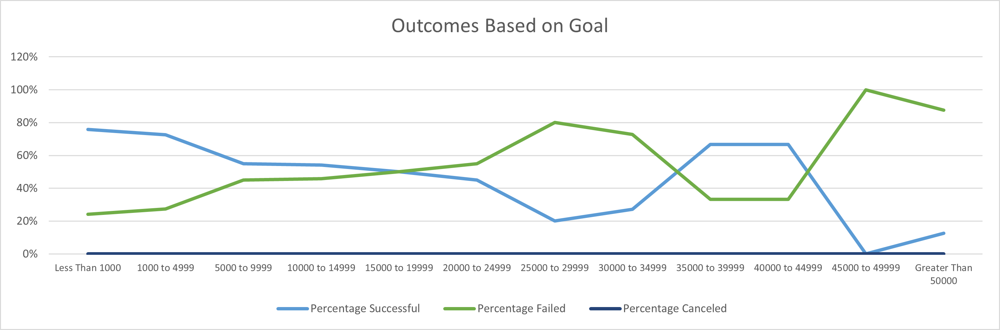

# Kickstarting with Excel

## Overview of Project

### Purpose
The purpose of this project is to help Louise by completing an analysis on several crowdfunding projects. In a short amount of time, Louise’s play Fever almost achieved its fundraising goal. Through the analysis, we will help Louise to understand how different campaigns performed in relation to her launch dates and funding goals. 

## Analysis and Challenges

### Analysis of Outcomes Based on Launch Date
May had the most successful campaigns, it also had the highest number of failed campaigns. June, July and October had around the same amount of failed campaigns. 
These results are portrayed in the chart below. Starting in January, successful campaigns begin to trend upwards, reaching the highest point in May. After May, the number of successful campaigns descend month over month. The line for cancelled outcomes has a gap in October, as the number of canceled campaigns was zero. 

### Analysis of Outcomes Based on Goals
When applying the filter for Subcategory Plays, there are zero canceled campaigns for all goal ranges. Campaigns with a goal of less than $1,000 had the highest percentage of successful campaigns 76%. Goal range $45,000 to $49,999 had 100% of the campaigns failed. 

### Challenges and Difficulties Encountered
Challenges could be encountered if the data is not filtered. The Dataset provided has many categories without adding the filter for Theatres or Plays the data provided would be too broad. We would not be able to draw on any conclusions that would help Louise make decisions for her future Play campaigns.

## Results

### Conclusion Outcomes based on Launch Date
- May, June and July had the highest amount of successful outcomes. To ensure a successful outcome, Louise should plan to have her Plays launch date in May, June or July. 
- To avoid her play being canceled, Louise should not plan a launch date for January. 

### Conclusion on the Outcomes based on Goals
- Campaigns with a goal of less than $1,000 had the highest percentage of successful campaigns. Followed by campaigns with a goal of $1,000 to $4,999. Campaigns with a goal greater than $45,000 have a higher percentage of failing. To ensure a successful outcome for her Play, Louise should create a goal of less than $4,999. 

### Limitations of the Dataset
- The Dataset does not provide any data for the Theatre category past 2017. This could provide some incorrect trends for Lousie if she wishes to start a new play in 2021. 
- We can check if there is any data from recent years that could help supplement this dataset when providing our analysis and findings to Louise. 

### Possible Tables and/or Graphs
- Create a table for Outcomes Based on Launch Date filtering for subcategory Plays. This will help understand which month Plays were successful in. 
- Create a table for failed campaigns, show the difference to understand the amount that each campaign failed by. 
